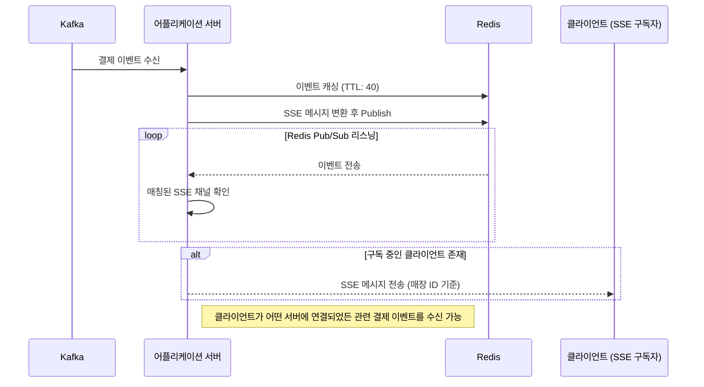

# SSE & Redis 기반 실시간 결제 이벤트 아키텍처 설계 및 구축

### Situation

매장 내 설치된 디바이스에서 손님이 결제하면, 결제 성공 시 **실시간으로 결제 내역을  표시**해야 했습니다.   
결제는 별도 시스템에서 처리되었으며, **클라이언트가 폴링 방식으로 조회하는 것은 성능 부담**이 컸습니다.

### Task
서버에서 **결제 이벤트를 감지하고 즉시 클라이언트로 전달할 수 있는 아키텍처**를 설계해야 했습니다.

- 다중 서버 환경에서 이벤트 전달 구조 최적화
- SSE 연결 유실 시 미수신 이벤트 복구 방식 구현
- API Gateway 자동 연결 종료 문제 해결
- 불필요한 채널 유지 방지 및 리소스 최적화

### Action

#### 기술 비교 및 SSE(Server-Sent Events) 선택

- **단방향 통신만 필요**하여 SSE가 적합
- **기존 HTTP(S) 프로토콜 활용** → 인프라 변경 없이 사용 가능
- **보안 고려** → WebSocket 도입 시 추가 보안 검토 필요, 부담이 큼

#### 다중 인스턴스 환경에서 이벤트 라우팅 문제 해결

- Kafka 결제 이벤트 수신 → **Redis Pub/Sub을 통해 목적에 맞는 토픽으로 이벤트 발행**
- **클라이언트가 SSE 연결 시 매장 ID를 키로 등록**, 각 서버는 매장 ID별로 SSE 채널을 관리
- 각 서버는 Redis에서 이벤트를 구독, 이벤트의 **매장 ID가 자신이 관리하는 채널과 일치하면 클라이언트로 전송**
- **구독하는 클라이언트가 없으면 채널 자동 제거**하여 불필요한 리소스 낭비 방지

#### SSE 연결 유실 시 미수신 이벤트 복구 (Redis TTL 기반 캐싱 활용) 

- lastEventId 기반 복구: 클라이언트가 SSE 연결 유실 후 재연결 시, **Redis에서 lastEventId 이후의 최신 메시지를 조회해 1개만 재전송하도록 구현**
- 40초 TTL 설정: 결제 이벤트 특성상, 오래된 데이터는 의미가 없어 Redis에 40초간만 캐싱, 불필요한 데이터 저장 방지

#### API Gateway의 연결 유지 문제 해결
- API Gateway가 일정 시간 트래픽이 없으면 SSE 연결을 자동 종료하는 문제 발생
- 서버가 일정 간격으로 heartbeat 메시지를 전송해 API Gateway의 자동 종료를 방지

#### 아키텍처 공유 및 문서화

- 클라이언트 개발자와의 원활한 협업을 위해 시퀀스 다이어그램을 작성하여 이벤트 흐름을 정리
- 전체적인 서비스 연동 방식을 시각적으로 표현한 시스템 구성도 작성

### Architecture

### Result

- SSE 기반 실시간 이벤트 전송을 구현하여 폴링 없이 효율적으로 결제 내역을 제공했습니다.   
- Redis Pub/Sub을 활용한 이벤트 라우팅을 통해 다중 서버 환경에서도 정확한 이벤트 전달을 보장했습니다. 
- 프로젝트를 계획대로 완료했으며, 결제 내역 실시간 전송 기능을 성공적으로 배포했습니다.
