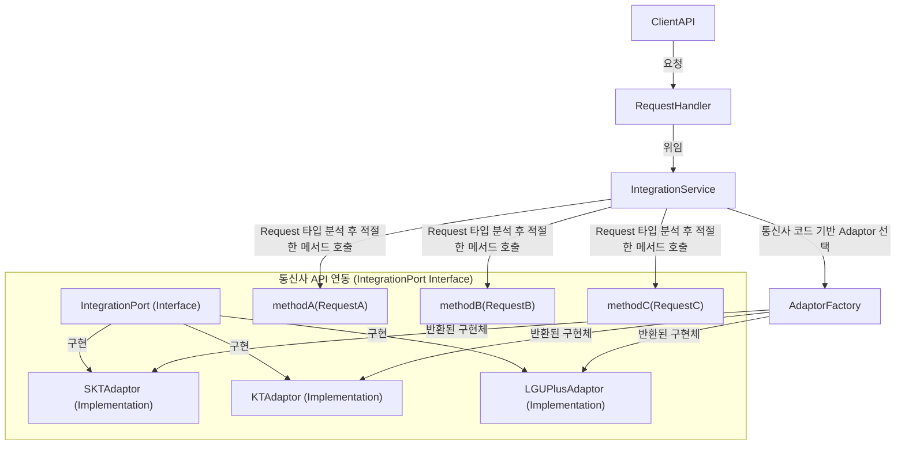

# 확장성을 고려한 설계 – 빠른 통신사 연동과 시장 대응력 확보

### Situation

통신 관련 신사업을 추진하면서, 서비스의 시장성을 빠르게 입증해야 했습니다. 제한된 시간 내에 안정성을 유지하면서 여러 통신사와의 연동을 신속히 완료하는 것이 핵심 과제였습니다. 그러나 통신사별로 상이한 API 스펙과 요구사항으로 인해, 신규 통신사 추가 시 내부 비즈니스 로직을 수정해야 하는 확장성 문제가 있었습니다.

### Task
- 신규 통신사 연동 시 **내부 로직 수정 없이 확장 가능한 구조**를 설계
- **통신사별 API 차이를 최소화**하여 연동 속도를 단축
- 일정 내에 안정적으로 여러 통신사 연동을 완료

### Action
- **통신사 담당자 인터뷰 및 API 문서 분석**을 통해 각 통신사의 요구사항을 정리
- 통신사별 API 차이점을 비교하여 **공통 패턴을 도출하고 변동 요소를 식별**
- API 인터페이스를 추상화하여 내부 도메인과 분리하고 **통신사별 차이가 나는 부분만 구현**하면 되도록 아키텍처 설계

### Architecture

- Factory 패턴을 활용한 통신사 Adaptor 관리
  - AdaptorFactory를 통해 IntegrationPort 구현체를 동적으로 선택하여 확장성과 유지보수성을 높임
  - 새로운 통신사를 추가할 때도 기존 로직을 수정하지 않고 새로운 IntegrationPort 구현체만 추가
- 도메인 로직과 외부 연동 코드의 분리
  - IntegrationService가 도메인 로직을 보호하고, 통신사 API 호출을 IntegrationPort 구현체에 위임함으로써 코드의 응집도를 높임
- Request 타입 기반의 메서드 선택
  - IntegrationService가 Request 타입을 분석하여 적절한 IntegrationPort 메서드를 선택함으로써 코드 일관성을 유지
  - 동일한 프로세스를 거치지만, 통신사별로 Request/Response 데이터 구조가 다를 수 있기 때문에 이를 효과적으로 처리

### Result

- 초기 플랫폼 개발에는 3개월이 소요되었으나, **두 번째 통신사 연동은 1개월, 세 번째는 2주 만에 완료**
- 내부 비즈니스 로직 수정 없이 **구현 클래스 추가만으로 신규 통신사 연동 가능**
- 빠른 통신사 연동으로 인해 서비스 출시 후 **6개월 만에 J커브 형태의 매출 성장** 달성
- 확장성 있는 구조를 기반으로 회사의 **신규 수익 모델 창출에 기여**
